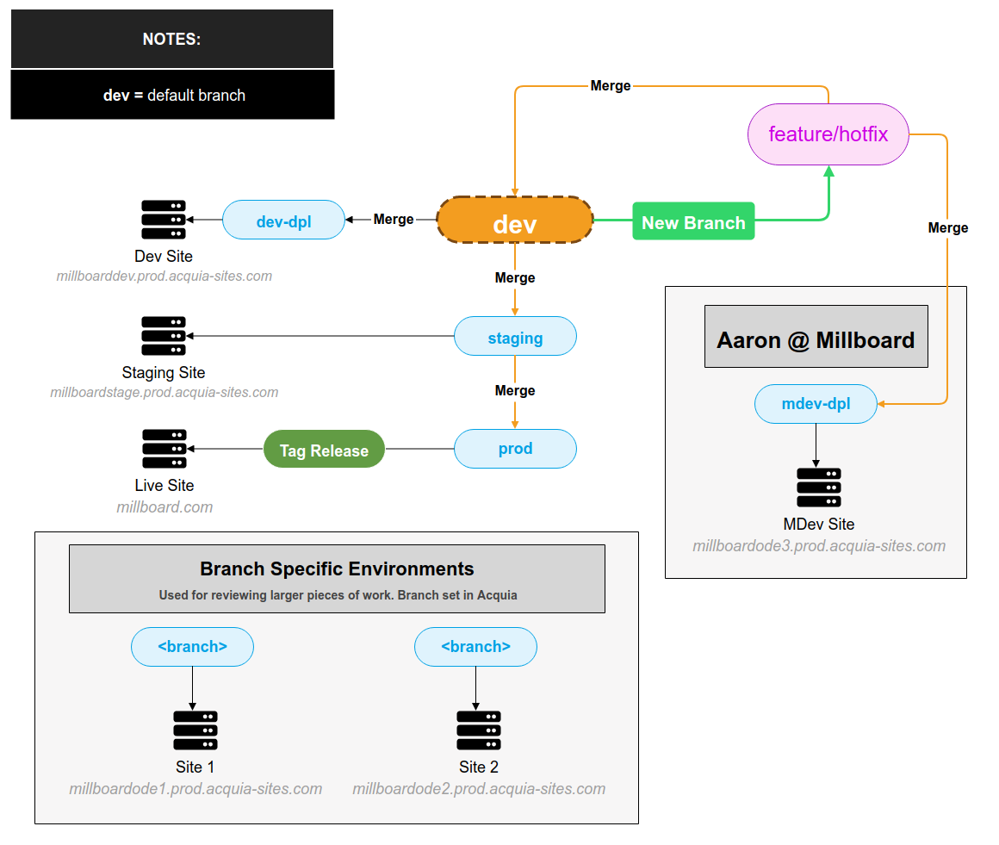

# Millboard (Drupal + Site Studio)

## Table of Contents

[[_TOC_]]

## Git Workflow

`dev` branch is the main branch for development. All branches should be created from `dev`

As this follows a bottom up workflow, anything that goes into `dev` will get merged up to `staging` and `prod` branches.

### Branch Naming

`feature/` - for new features

`hotfix/` - for bug fixes

### Workflow Diagram

## Environments & Deployment

| Environment  | URL                                                                                        | Branch                  | Deployment Branch | Purpose                                                                       |
|--------------|--------------------------------------------------------------------------------------------|-------------------------|-------------------|-------------------------------------------------------------------------------|
| Branch Env 1 | [http://millboardode2.prod.acquia-sites.com](http://millboardode2.prod.acquia-sites.com)   | `<any branch selected>` | "                 | A place for testing larger features that need their own dedicated environment |
| Branch Env 2 | [http://millboardode1.prod.acquia-sites.com](http://millboardode1.prod.acquia-sites.com)   | `<any branch selected>` | "                 | A place for testing larger features that need their own dedicated environment |
| MDev         | [http://millboardode3.prod.acquia-sites.com](http://millboardode3.prod.acquia-sites.com)   | `mdev-dpl`              | `mdev-dpl`        | Aaron @ Millboard - Test environment                                          |
| Dev          | [http://millboarddev.prod.acquia-sites.com](http://millboarddev.prod.acquia-sites.com)     | `dev`                   | `dev-dpl`         | Development - Testing before go live                                          |
| Staging      | [http://millboardstage.prod.acquia-sites.com](http://millboardstage.prod.acquia-sites.com) | `staging`               | `staging`         | Staging - Final verification before go live                                   |
| Prod         | [http://millboard.prod.acquia-sites.com](http://millboard.prod.acquia-sites.com)           | `prod`                  | `git tagged`      | Production - Live site                                                        |

